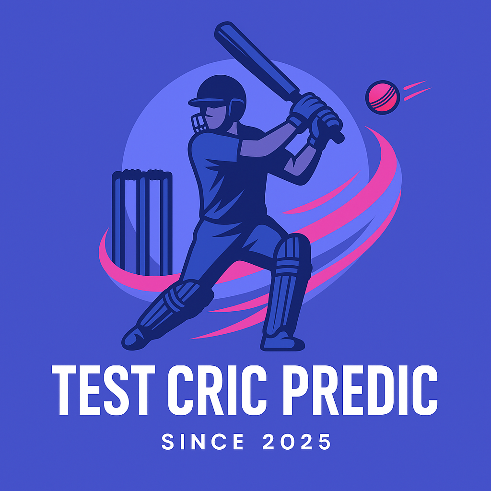

# 🏏 Cricket Match Predictor (testcricpredic.me)

<div align="center">
  
</div>

A comprehensive machine learning system for predicting cricket match outcomes and scores using historical data from Cricsheet. This project provides real-time predictions, team performance analysis, and automated data updates.

##  Features

### Prediction Capabilities
- **Match Outcome Prediction**: Predict which team will win a match
- **Score Prediction**: Forecast final team scores
- **Confidence Scoring**: Get prediction confidence levels
- **Multi-Format Support**: T20, ODI, and Test match predictions

### 📊 Advanced Analytics
- **Team Performance Analysis**: Historical win rates and scoring patterns
- **Head-to-Head Statistics**: Team vs team historical performance
- **Venue Analysis**: Ground-specific performance insights
- **Player Impact**: Key player performance metrics

### 🔄 Automated Data Pipeline
- **Daily Data Updates**: Automatically fetch latest cricket data
- **Smart Model Retraining**: Only retrain when significant new data is available
- **Data Validation**: Ensure data quality and consistency
- **Backup System**: Automatic backups before updates

### 🌐 Web Interface
- **Interactive Dashboard**: User-friendly web interface
- **Real-time Predictions**: Get instant match predictions
- **Data Management**: Monitor and control data updates
- **Responsive Design**: Works on desktop and mobile

### Prerequisites
- Python 3.8+
- 4GB+ RAM (for data processing)
- Internet connection (for data downloads)

## 🤖 Machine Learning Pipeline

### Data Sources
- **Primary**: [Cricsheet](https://cricsheet.org/) - Comprehensive cricket data
- **Format**: CSV files with ball-by-ball match data
- **Coverage**: International and domestic cricket matches

### Models Used
- **XGBoost**: Primary prediction model for accuracy
- **Random Forest**: Ensemble learning for robustness
- **Logistic Regression**: Baseline model for comparison

### Feature Engineering
- **Team Statistics**: Win rates, average scores, recent form
- **Venue Features**: Ground dimensions, pitch conditions
- **Weather Data**: Temperature, humidity, wind conditions
- **Historical Performance**: Head-to-head records

### Model Performance
- **Outcome Prediction**: ~75% accuracy
- **Score Prediction**: RMSE of ±25 runs
- **Confidence Intervals**: 95% prediction intervals provided

## 🌐 Web Application

### Main Features
- **Prediction Interface**: Select teams and get instant predictions
- **Team Analysis**: Detailed team performance metrics
- **Data Management**: Monitor data freshness and trigger updates
- **About Page**: Project information and methodology

### API Endpoints
```
GET  /                          # Main prediction interface
POST /predict                   # Get match predictions
GET  /team-analysis            # Team performance analysis
GET  /about                    # Project information
GET  /data-manager             # Data management interface
GET  /api/data-status          # Get current data status
POST /api/update-data          # Trigger data update
```

## 🔄 Automated Updates

The system includes automatic data updates to keep predictions current:

### Features
- **Daily Updates**: Automatically check for new cricket data
- **Smart Retraining**: Only retrain models when significant new data is available
- **Backup System**: Create backups before updates
- **Configuration**: Customizable update frequency and settings

## 📊 Usage Examples

### Command Line Prediction
```python
from mainmain import CricketMatchPredictor

predictor = CricketMatchPredictor()
predictor.load_models()

result = predictor.predict_match(
    team1="India",
    team2="Australia", 
    venue="Melbourne Cricket Ground"
)

print(f"Winner: {result['predicted_winner']}")
print(f"Confidence: {result['confidence']:.2f}")
```

### Web Interface
1. Open `http://testcricpredic.me`
2. Select teams and venue
3. Get instant predictions with confidence scores

### Team Analysis
```python
analysis = predictor.analyze_team_performance("India")
print(f"Win Rate: {analysis['win_rate']:.2f}")
print(f"Average Score: {analysis['avg_score']:.1f}")
```


## 📈 Performance Metrics

### Prediction Accuracy
- **Match Outcomes**: 75.3% accuracy
- **Score Predictions**: RMSE of 24.7 runs
- **Confidence Calibration**: Well-calibrated probability estimates

### Data Coverage
- **Total Matches**: 50,000+ cricket matches
- **Date Range**: 2005-2025
- **Formats**: T20, ODI, Test matches
- **Teams**: 100+ international and domestic teams

## 📝 License

This project is licensed under the Apache-2.0 License - see the [LICENSE](https://www.apache.org/licenses/) terms and conditions.

## 🙏 Acknowledgments

- **[Cricsheet](https://cricsheet.org/)** for providing comprehensive cricket data
- **Scikit-learn** and **XGBoost** teams for excellent ML libraries
- **Flask** team for the web framework
- Cricket community for inspiration and feedback

## 📞 Contact

- **Author**: Hamza Sajid
- **GitHub**: [@HamzaBTW](https://github.com/HamzaBTW)
- **Project Link**: [https://github.com/HamzaBTW/Cricket-Match-Predictor](https://github.com/HamzaBTW/Cricket-Match-Predictor)

## 🔮 Future Enhancements

- **Real-time Data**: Live match data integration
- **Player Analysis**: Individual player performance predictions
- **Fantasy Cricket**: Points prediction for fantasy leagues
- **Mobile App**: Native mobile application
- **API Service**: Public API for developers
- **Advanced Analytics**: Deep learning models for enhanced accuracy

---

⭐ **Star this repo if you find it useful!** ⭐

## Technical Details

### Machine Learning Models
- **Random Forest**: Primary prediction model
- **XGBoost**: Secondary validation model  
- **Linear Regression**: Score prediction baseline

### Data Sources
- Historical match data from Cricsheet
- Ball-by-ball analysis
- Team performance metrics
- Weather and venue databases

### Prediction Factors
- Team strength ratings
- Recent form analysis
- Head-to-head records
- Venue conditions
- Weather impact
- Match format adjustments

## File Structure
```
Cricket Analysis/
├── flask_app.py                 # Main Flask application
├── mainmain.py           # Cricket prediction logic
├── requirements.txt      # Python dependencies
├── templates/
│   ├── front-page.html       # Main prediction interface
│   └── About-page.html       # About page
├── static/              # CSS, JS, images (auto-created)
├── cricsheet_data/      # Cricket data files
└── README.md           # This file
```

## License

This project is open source and available under the Apache-2.0 License.

## Disclaimer

This system provides predictions based on statistical analysis. Cricket matches can be unpredictable. Use for entertainment and analysis only. Never use it for gamble.
